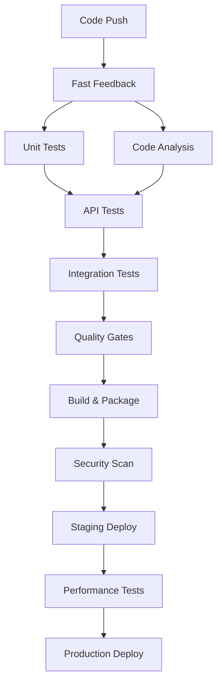

# 🚀 CI/CD Pipeline - TestJava Price Service

This document describes the Continuous Integration and Continuous Deployment (CI/CD) pipeline implementation for the TestJava Price Service.

## 📋 Overview

Our CI/CD pipeline is designed to provide fast feedback, ensure quality, and enable reliable deployments across multiple environments. It implements a comprehensive testing strategy with automated quality gates.

## 🏗️ Pipeline Architecture



## 🛠️ Supported Platforms

### 1. GitHub Actions (`.github/workflows/ci-cd.yml`)
- **Primary Platform**: Full-featured pipeline
- **Triggers**: Push, PR, scheduled builds
- **Features**: Parallel execution, artifacts, security scanning
- **Deployment**: Staging (develop) → Production (main)

### 2. GitLab CI (`.gitlab-ci.yml`)
- **Enterprise Ready**: Complete GitLab integration
- **Features**: Multi-stage pipeline, caching, environments
- **Container Registry**: Integrated Docker builds
- **Deployment**: Manual approval gates

### 3. Jenkins (`Jenkinsfile`)
- **Enterprise Grade**: Advanced pipeline with approval gates
- **Features**: Blue Ocean UI, Slack notifications, rollback
- **Flexibility**: Custom deployment strategies
- **Monitoring**: Integration with monitoring tools

## ⚡ Test Execution Strategy

### Fast Feedback Loop (< 10 seconds)
```bash
# Unit Tests - Isolated, fast, parallel
./gradlew fastTest
```

### API Validation (< 30 seconds)  
```bash
# API Layer Tests - MockMvc based
./gradlew validateApi
```

### Integration Tests (< 2 minutes)
```bash
# Full integration with database
./gradlew integrationTest
```

### Complete Validation (< 5 minutes)
```bash
# Full test suite with coverage
./gradlew ciTest
```

## 🛡️ Quality Gates

### Code Coverage
- **Overall Coverage**: ≥ 75%
- **New Code Coverage**: ≥ 80%
- **Branch Coverage**: ≥ 70%

### Code Quality
- **Maintainability**: Rating A
- **Reliability**: Rating A  
- **Security**: Rating A
- **Duplicated Lines**: ≤ 5%

### Security
- **Vulnerabilities**: 0
- **Security Hotspots**: 0
- **Dependency Scan**: Automated

### Testing
- **Test Success Rate**: 100%
- **Unit Tests**: < 10s execution
- **API Tests**: < 30s execution
- **Integration Tests**: < 2min execution

## 🚀 Deployment Strategies

### Staging Environment
- **Trigger**: Push to `develop` branch
- **Strategy**: Rolling deployment
- **Tests**: Smoke tests post-deployment
- **Approval**: Automatic

### Production Environment  
- **Trigger**: Push to `main` branch
- **Strategy**: Blue-green deployment
- **Tests**: Health checks, monitoring
- **Approval**: Manual approval required

## 📊 Pipeline Stages

### 1. **Validate** (30s)
- Checkout code
- Verify dependencies
- Compile source and tests

### 2. **Test** (2-5 minutes)
- Unit tests (parallel)
- API tests 
- Integration tests
- Coverage reporting

### 3. **Quality** (3-8 minutes)
- SonarQube analysis
- Security scanning
- Dependency checks
- Quality gate evaluation

### 4. **Build** (1-3 minutes)
- Application build
- Docker image creation
- Artifact archiving

### 5. **Deploy** (2-10 minutes)
- Environment deployment
- Health checks
- Smoke tests

## 🔧 Configuration

### Environment Variables
```bash
# Java Configuration
JAVA_VERSION=17
GRADLE_OPTS="-Dorg.gradle.daemon=false -Dorg.gradle.parallel=true"

# Security
SONAR_TOKEN=<sonar-token>
DOCKER_REGISTRY=<registry-url>

# Notifications
SLACK_CHANNEL=#deployments
```

### Quality Gates Configuration
See `quality-gates.yml` for detailed thresholds and rules.

### Secrets Required
- `SONAR_TOKEN`: SonarQube authentication
- `DOCKER_REGISTRY_TOKEN`: Container registry access
- `SLACK_WEBHOOK`: Notification integration

## 🐳 Docker Deployment

### Multi-stage Build
```dockerfile
# Build stage with JDK 17
FROM eclipse-temurin:17-jdk-alpine AS builder

# Runtime stage with JRE 17  
FROM eclipse-temurin:17-jre-alpine AS runtime
```

### Container Features
- **Security**: Non-root user, minimal base image
- **Monitoring**: Health checks, JVM optimization
- **Size**: Optimized layers, < 200MB target

## 📈 Monitoring & Observability

### Health Checks
- **Liveness**: `/actuator/health/liveness`
- **Readiness**: `/actuator/health/readiness` 
- **Startup**: `/actuator/health`

### Metrics
- **Prometheus**: `/actuator/prometheus`
- **Application**: Custom business metrics
- **JVM**: Memory, GC, threads

### Logging
- **Structured**: JSON format
- **Levels**: Environment-specific
- **Correlation**: Request tracing

## 🚀 Quick Start

### Local Development
```bash
# Run tests
./gradlew fastTest

# Full local pipeline
./scripts/deploy.sh local

# Access application
curl http://localhost:8080/actuator/health
```

### CI/CD Setup

#### GitHub Actions
1. Enable GitHub Actions in repository
2. Add secrets: `SONAR_TOKEN`, `DOCKER_REGISTRY_TOKEN`
3. Push to trigger pipeline

#### GitLab CI
1. Configure GitLab runner
2. Add CI/CD variables in project settings
3. Push to trigger pipeline

#### Jenkins
1. Create multibranch pipeline
2. Configure webhook triggers
3. Install required plugins: SonarQube, Slack

## 📚 Commands Reference

### Development
```bash
./gradlew fastTest              # Quick unit tests
./gradlew validateApi           # API layer tests
./gradlew integrationTest       # Full integration
./gradlew fullTest             # Complete test suite
```

### Quality Assurance
```bash
./gradlew testCoverageReport   # Coverage report
./gradlew sonar                # Code quality analysis
./gradlew dependencyCheckAnalyze # Security scan
```

### Deployment
```bash
./scripts/deploy.sh staging           # Deploy to staging
./scripts/deploy.sh production -v v1.2.3 # Deploy specific version
./scripts/deploy.sh --rollback v1.2.2 production # Rollback
```

### Docker
```bash
docker build -t testjava-priceservice .
docker run -p 8080:8080 testjava-priceservice
```

## 🔍 Troubleshooting

### Pipeline Failures

#### Test Failures
```bash
# Check test reports
open build/reports/tests/test/index.html

# Run specific test
./gradlew test --tests "*PriceServiceTest"
```

#### Quality Gate Failures
```bash
# Local SonarQube analysis
./gradlew sonar

# Check coverage
./gradlew jacocoTestReport
open build/reports/jacoco/test/html/index.html
```

#### Deployment Issues
```bash
# Check deployment logs
./scripts/deploy.sh staging --dry-run

# Verify health
curl -f http://localhost:8080/actuator/health
```

### Common Issues

1. **Tests Timeout**: Increase timeout in test configuration
2. **Coverage Below Threshold**: Check exclusions in `build.gradle`
3. **Docker Build Fails**: Verify Dockerfile and dependencies
4. **Deployment Fails**: Check environment configuration and secrets

## 📞 Support

- **Documentation**: This README and inline comments
- **Issues**: GitHub/GitLab issue tracker
- **Team Chat**: Slack #testjava-support
- **On-call**: Production deployment support

## 🔄 Continuous Improvement

### Pipeline Optimization
- Monitor execution times
- Optimize test parallelization
- Cache dependencies effectively
- Minimize Docker layers

### Quality Enhancement
- Regular quality gate reviews
- Security scanning updates
- Performance benchmarking
- Automated dependency updates

---

**Last Updated**: 2024-01-XX  
**Version**: 1.0.0  
**Maintained by**: TestJava Development Team